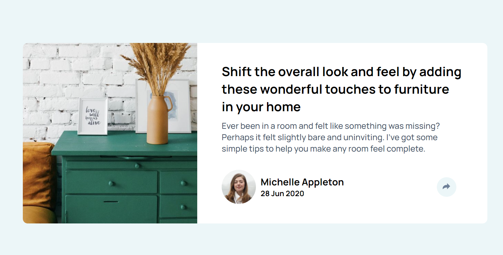
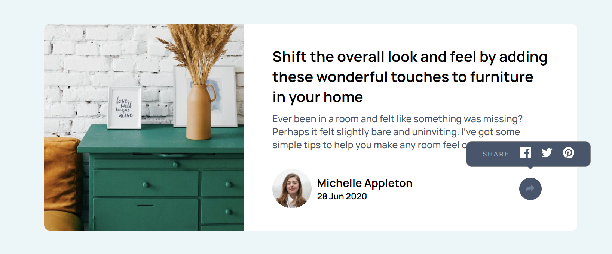

# Frontend Mentor - Article preview component solution

This is a solution to the [Article preview component challenge on Frontend Mentor](https://www.frontendmentor.io/challenges/article-preview-component-dYBN_pYFT). Frontend Mentor challenges help you improve your coding skills by building realistic projects. 

### Screenshot

**Desktop**

**Desktop active state**

### Built with

- Semantic HTML5 markup
- CSS custom properties
- Sass
- Flexbox
- CSS Grid
- Vanilla JavaScript
